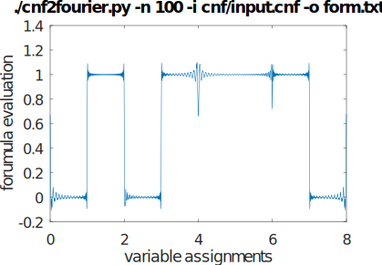

# cnf2fourier.py
 
Utilizies the harmonic properties of a CNF formula and by using Fourier Series approximations
converts it into a mathematical formula.

A visualization of the formula for cnf/input.cnf 

This is more of a demonstration to that an 
approximation algorithm (fixed n Fourier series) could be helpful to determine if a 
CNF formula is satisfiable or not.  

I conceived this during a University course on complexity (NP=P, NP!=P, NP Completeness) 
a long time ago and thought it was interesting enough to do an implementation.    
If you have any comments or suggestions, feel free to email me at powertech2718@gmail.com


## Full Description 

Reading a DIMACS file, it will convert a CNF clause's literals to
an interval struct: Period, offset and count and then create a Fourier
series for that literal in the clause.  Then by combining these multiple equations
using mathematical logic (DeMorgan's Law, product for AND, and 1-X for NOT) it will create
a formula that should approximate the logic of a CNF for k variables. 

## Usage

To display the options: 
```
$ cnf2fourier.py -h

usage: cnf2fourier [-h] -n MAX_N -i INPUT -o OUTPUT

Creates a mathematical formula from a cnf dimacs file

options:
  -h, --help            show this help message and exit
  -n MAX_N, --max_n MAX_N
                        Fourier series summation -1*max_n to max_n value
  -i INPUT, --input INPUT
                        <filename (input)>: DIMACS filename
  -o OUTPUT, --output OUTPUT
                        <filename (output)>:

```  

## Examples
```
$ ./cnf2fourier.py -i cnf/input.cnf -o form.txt -n 2
Creating forumula...
Processing integral...
Number of solutions between 0 8: 5.08627787690147
```

